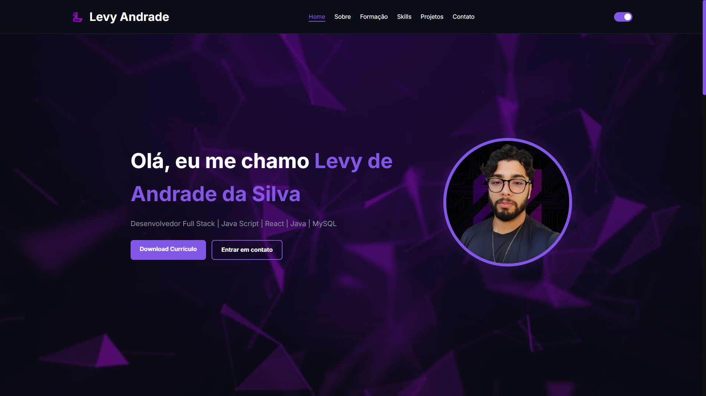

# 🚀 Portfolio Pessoal - Levy Andrade

Bem-vindo ao repositório do meu portfólio! Este projeto foi desenvolvido para centralizar minha trajetória acadêmica, minhas habilidades técnicas e os projetos full stack que venho construindo.

## ✨ O Projeto
O portfólio foi desenhado com uma estética **Cyberpunk/Dark Mode**, focado em uma experiência imersiva e moderna. Através dele, apresento quem sou, minha formação na **Unipar** e como utilizo a tecnologia para transformar ideias em soluções reais e escaláveis.

## ✨ Preview do Projeto

---

## 🛠️ Tecnologias & Arsenal Técnico

O projeto foi construído utilizando as melhores práticas de desenvolvimento web:

*   **Frontend:** React.js, Tailwind CSS (estilização) e Vite.
*   **Backend:** Java com Spring Boot.
*   **Banco de Dados:** MySQL.
*   **Design & Versionamento:** Figma, Git e GitHub.

---

## 🎨 Funcionalidades Principais

*   **⚡ Seção Sobre Mim:** Um resumo da minha jornada e foco total na stack Java, Spring Boot e React.
*   **🎓 Linha do Tempo Acadêmica:** Detalhes sobre minha graduação em Análise e Desenvolvimento de Sistemas.
*   **💼 Galeria de Projetos:** Cards interativos exibindo trabalhos autorais e para clientes reais.
*   **🛡️ Badges de Skills:** Exibição das minhas "insígnias" técnicas e ferramentas de maestria.
*   **📱 Responsividade Total:** Interface otimizada para desktops, tablets e dispositivos móveis.

---

## 📂 Projetos em Destaque

1.  **Zynk Finance Dashboard:** Sistema de gestão financeira focado em UX e organização de dados.
2.  **Pokémon Battle Arena:** Aplicação que exercita a lógica de programação e manipulação de estado.
3.  **Portfólio Publicitária:** Site profissional desenvolvido sob medida para a publicitária Lorraini Paris.

---

## 📬 Vamos conversar?

Estou sempre em busca de novos desafios, aprendizados e parcerias em projetos inovadores.

*   **LinkedIn:** [Levy Andrade](https://www.linkedin.com/in/levy-andrade/)
*   **GitHub:** [@Levy-Andrade](https://github.com/Levy-Andrade)
*   **E-mail:** levyandrade2109@gmail.com

---

> *"Não importa o quão difícil seja, nunca perca de vista o seu objetivo."* 🚀

---
Desenvolvido por Levy Andrade.